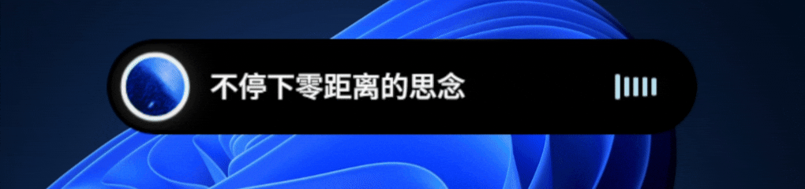
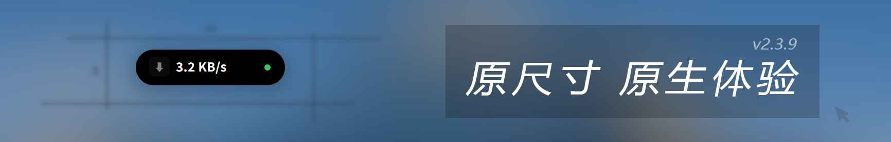
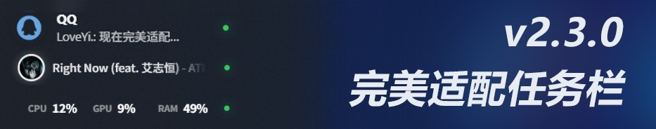
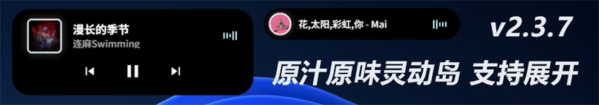

# NetSpeed Dynamic Pro (NSD)

<div align="center">


**NetSpeed Dynamic Pro** —— Dynamic Island for Windows

[](https://tauri.app)
[](https://rust-lang.org)
[](https://vuejs.org)
[](https://www.typescriptlang.org)
[](https://vite.dev)
[](https://echarts.apache.org)

[简体中文](./README.md) &nbsp; | [English](./README.en.md) &nbsp; | [Download](https://github.com/GEORGEWWWU/NetSpeed-Dynamic/releases/latest) &nbsp; | [Website](https://nsd.georgewu.top/)

</div>







---

A Dynamic Island desktop widget built with **Tauri 2 + Rust + Vue 3**. The floating Dynamic Island displays real-time network speeds, supports multi-platform music control, traffic statistics, system notification reception, and system event monitoring. It can be pinned to the bottom-left corner of the taskbar.

## Features

### Network Speed Monitoring

- **Real-time Network Speed**: Upload/download speeds refresh every second with automatic unit switching
- **Dynamic Island Floating Window**: Supports drag movement and spring animation transitions
- **Network Status Indicator**: Green (normal)/Yellow (high latency)/Red (disconnected)
- **Traffic Highlighting**: Arrow automatically highlights when speed exceeds 1MB/s
- **Speed Trend Chart**: Built-in mini line chart showing the last 15 seconds of download speed
- **Local Traffic Statistics**: Automatically records daily upload/download data with bar chart/line chart visualization
- **Monthly Traffic Statistics**: Real-time calculation of cumulative monthly traffic usage

### Multi-platform Music Control

- **Playback Control**: Previous / Play/Pause / Next (via system SMTC API)
- **Multi-platform Support**: NetEase Cloud Music, Spotify, Apple Music, QQ Music, Kugou Music, Echo Music
- **Song Information**: Real-time display of song title, artist, and album cover
- **Cover Rotation**: Cover auto-rotates during playback, stops when paused
- **Multi-source Cover Fetching**: Prioritizes local HD covers from system SMTC, falls back to NetEase Cloud, Deezer, Apple Music, with SVG gradient as final fallback
- **Cover Cache**: Intelligent caching of the last 50 song covers for improved response speed
- **Rainbow Flowing Border**: 8-color gradient rotating border with independent toggle
- **Audio Spectrum Visualization**: Real-time capture of system audio output, generates 5-band rhythm spectrum via FFT transformation that beats with music
- **Song Title Scrolling**: Long titles auto-scroll horizontally, switches to dual-line display when expanded
- **Smart Interaction**: Controls appear on hover, auto-switches to song info on leave, auto-collapses after 1 second

### System Notifications

- **Real-time Capture**: Receives system Toast notifications and displays them on the Dynamic Island
- **Dynamic Expansion**: Dynamic Island automatically expands to show app icon, title, and content when notifications are received
- **Smart Filtering**: Automatically filters WeChat notifications to avoid interference
- **Click to Open**: Click notification area to directly open the corresponding app (supports QQ, WeChat, DingTalk, etc.)
- **Silent Message Mode**: Auto-hides normally, pops up only when messages are received

### System Event Monitoring

- **Volume Change Detection**: Real-time monitoring of system volume changes with automatic notification
- **Power Status Monitoring**: Detects power plug-in/out status with charging state icon
- **Low Battery Warning**: Auto-triggers red warning notification when battery is below 20%
- **Dedicated SVG Icons**: Independent icons for charging/low battery/lock/unlock
- **Notification Queue Priority**: System notifications take priority over operation notifications, message notifications have highest priority

### Settings & System Integration

- **Theme Switch**: Light/Dark/Follow System
- **Dynamic Island Color**: Supports black/white background color switching
- **Opacity Adjustment**: 0%~100% real-time sync to floating window
- **Auto-start**: Launches with system, main window hidden during silent startup
- **System Tray**: Left-click to open console, right-click to force exit
- **Pin to Taskbar**: Lock to bottom-left corner of screen, disable dragging, auto-topmost
- **Position Lock**: Right-click menu to lock/unlock Dynamic Island position
- **Fullscreen Game Avoidance**: Auto-detects fullscreen windows to avoid focus stealing
- **Update Check**: Silent detection of new versions with download prompt, supports 10-second timeout protection

## Tech Stack

| Layer | Technology |
|-------|------------|
| Desktop Framework | Tauri 2 (Rust) |
| Frontend Framework | Vue 3 + TypeScript |
| Build Tool | Vite 6 |
| Router | Vue Router 5 |
| Charts | ECharts 6 |
| Icons | Lucide Vue Next |
| Network Monitoring | sysinfo (Rust) |
| Async Runtime | Tokio (Rust) |
| HTTP Client | reqwest (Rust) |
| Media Control | Windows SMTC API |
| Audio Capture | cpal (Rust) |
| Spectrum Analysis | rustfft (Rust) |
| System Events | Windows COM API |
| Windows API | windows-sys + winapi |
| Local Storage | localStorage |

## Project Structure

```
NetSpeed-Dynamic/
├── src/                    # Frontend source code
│   ├── main.ts             # Application entry
│   ├── router/index.ts     # Router configuration
│   ├── views/
│   │   ├── MainPanel.vue   # Main console (settings, statistics, music platform switch)
│   │   └── WidgetIsland.vue # Dynamic Island floating window (network speed, music, messages, hardware, spectrum)
│   └── assets/             # Static assets (icons, screenshots)
├── src-tauri/              # Tauri backend
│   ├── src/
│   │   ├── main.rs         # Rust entry
│   │   ├── lib.rs          # Core logic
│   │   ├── audio_spectrum.rs # Audio spectrum analysis (FFT)
│   │   ├── music_controller.rs # Music controller (SMTC API)
│   │   ├── notification.rs # System notification capture
│   │   └── system_events.rs # System event monitoring (volume, power)
│   ├── Cargo.toml          # Rust dependencies
│   └── tauri.conf.json     # Tauri configuration
└── package.json            # Frontend dependencies
```

## Development Environment

### Prerequisites

- Node.js >= 18
- Rust >= 1.70
- Tauri 2 CLI

### Installation & Running

```bash
git clone https://github.com/GEORGEWWWU/NetSpeed-Dynamic.git
cd NetSpeed-Dynamic
npm install
npm run tauri dev
```

### Build & Release

```bash
npm run tauri build
```

Output is located at `src-tauri/target/release/bundle/`.

## Usage

1. After launching, the main console appears. Click the system tray to open it anytime
2. Enable the Widget toggle, and the Dynamic Island floating window appears at the top of the screen
3. Left-click to drag and move, right-click menu to reset position, lock position, toggle rainbow border, or close
4. In "Dynamic Island Settings", select music platform, enable music control, and message notifications
5. In "Dynamic Island Settings", switch Dynamic Island color (light/dark) and enable silent message mode
6. Switch between general settings and data statistics panels on the right side of the console, supports bar chart/line chart switching

## License

MIT License

Copyright (c) 2026 Ryen (GEORGEWU)

## Donation

If NSD helps you, feel free to buy the author a coffee!

| Method | Information |
|--------|-------------|
| WeChat Pay | [WeChat](./src/assets/wechat-pay.png) |
| Alipay | [Alipay](./src/assets/alipay.jpg) |
| GitHub Sponsors | [Support Here](https://github.com/sponsors/GEORGEWWWU) |

---

> Thank you to every supporter!
